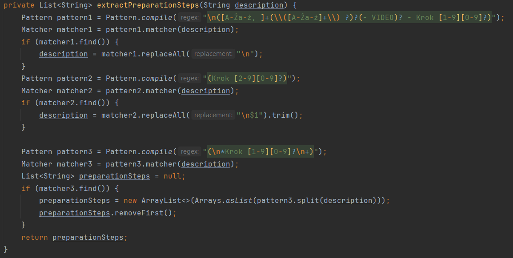
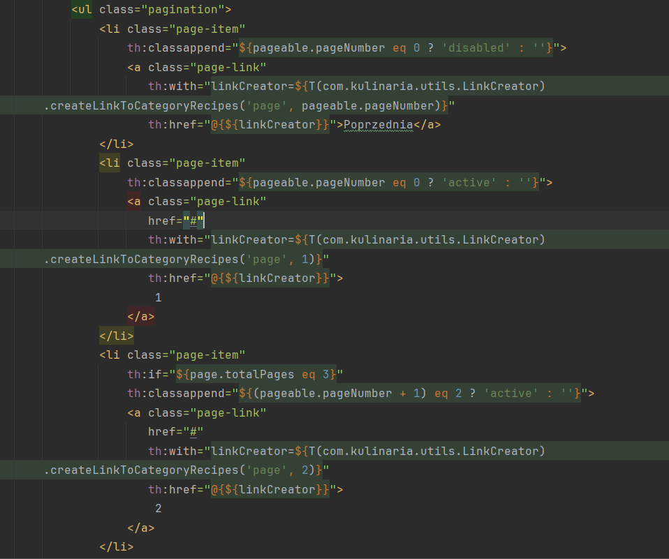

<h1 align="center"> Kulinaria 

</h1> 

<h3 align="center">Technologies used:</h3>

<h1 align="center">

</h1> 

  

<h3 align="center">
  Hibernate and H2 database oriented Cookbook training project
</h3>
  

<h2 align="center">

</h2>

<h2 align="center">
  <a href="https://www.kulinaria.codingproductions.com" target="_blank">
    <h1>View Live Demo</h1>
  </a> 
   
   
  <a href="#">(please contact me for login credentials details)</a> 
</h2>

  

## Table Of Content
<ol>
    <li>
      <a href="#about-the-project">About The Project</a>
      <ul>
        <li><a href="#built-with">Built With</a></li>
      </ul>
    </li>
    <li>
      <a href="#solutions-worth-checking-out">Solutions Worth Checking out</a>
      <ul>
        <li><a href="#sql-scripts-creation">SQL Scripts Creation</a></li>
        <li><a href="#generating-project-links">Generating Project Links</a></li>
        <li><a href="#pagination">Pagination</a></li>
        <li><a href="#filtering-and-sorting">Filtering And Sorting</a></li>
        <li><a href="#use-of-photo-files-in-docker-container">Use Of Photo Files In Docker Container</a></li>
      </ul>
    </li>
    <li>
      <a href="#project-expansion-plans">Project Expansion Plans</a>
      <ul>
        <li><a href="#implementing-api">Implementing API</a></li>
        <li><a href="#filtering-recipes-by-name">Filtering recipes by name</a></li>
        <li><a href="#unit-testing">Unit testing</a></li>
      </ul>
    </li>
  </ol>

   
## About The Project

<h3 align="center">Home Page (laptop-like wide screen device)</h4>

  

 
<h3 align="center">Filtered recipes view (smartphone device)</h4>

  

This is a training Java application built for the purpose of myself evolving in the area of full stack programming focused on Java related technologies.   It is a Cookbook, still in the process of adding many more features in the near future.  
The main goal was to build a full stack web application that would extensively use Hibernate and H2 Database mechanisms, further deployed on the public Linux server (VPS, Debian). 
There have been several technologies combined to achieve the current result, some of which have been listed at the top of this document.
  
At this point project's UI is held in Polish language as a part of simulating challenges related to development of the project contracted by a non-English speaking client. 

  

### In this application you can:

- view the list of either all or categorized (dinners, salads, pasta, sandwiches) cooking recipes
- view the details of the chosen recipe (time of preparation, category, type, ingredients, preparation steps, photo)
- view the service content on different screen width devices **(pages are implemented as fully responsive, with different forms applied for different screen widths)**
- filter the recipes by type (meat or vegetarian) or clear the filter at any time
- sort recipes by title, vote number or preparation time (ascending and descending)
- use pagination to navigate through filtered and/or sorted recipe list
- **If you are logged in, you can:**
  - add a new photo or replace the existing one with local disk image file 
  - vote up or down any recipe 
  - modify preparation time, meal category and meal type (meat vs. vegetarian)
  - delete any recipe from the database 
  - add a new recipe to the database 
  - add new ingredients and modify or delete the existing ones 
  - add new preparation steps and modify or delete the existing ones 

(<a href="#readme-top">back to top</a>)

---

### Built With

| Technology / Language     | Description |
| -----------: | ----------- |
| | Spring boot 3.3.3, Spring Data JPA, Spring MVC|
| | For preventing unauthorized users from modifying recipe data and from voting|
||Oracle JDK 21.0.3|
||Used a bit to reduce a code bloat when implementing Spring Security related classes|
|| Especially for filtering and converting plain text data to SQL scripts |
||For automatic table creation and test data upload|
|  | Used along with Hibernate to load test data to tables |
| | Used as a convenient replacement for external database like MySQL. At this point H2 Database fully meets project's requirements |
|| Used as part of Spring MVC to build dynamic server web pages|
|  | Pretty extensive use of HTML 5 and CSS 3 capabilities |
| |Version 5.3.3, used especially for styling, page responsiveness and resizing recipe ingredients and preparation steps tables|
| | Github used as a remote repository both for my local OS (Windows) repository and for VPS OS (Debian) repository |
| |Installed on remote VPS. Dockerfile used for multi-stage build (Maven image to build JAR file and JDK image to run the actual application container). Also Nginx Proxy Manager container used for port forwarding and for HTTPS SSL |
 | Debian GNU/Linux 12 (bookworm) used as a Virtual Private Server (VPS) |
| |Bash script for automation of application container full restart (image rebuild, container stoppage, removal and restart based on newly built image)|

(<a href="#readme-top">back to top</a>)

## Solutions Worth Checking Out

### SQL Scripts Creation

The goal was to automate the creation of SQL scripts that would further be used to load test data to all database tables. The additional target was to use the pre-existing plain text containing all recipe ingredients, amounts and preparation descriptions. Hence any online SQL generator had to be omitted.   Creating all SQL DML queries manually would be an incredibly tedious task to do, therefore I decided to implement a separate project class (com.kulinaria.utils.TestDataCreator) with its own main function to use it once only and to let it create all the necessary SQL files with all the necessary DML queries in them for me automatically.   This allowed me to transform the following .txt files:

  

    
  

  ...into these full-fledged SQL scripts further used by Hibernate / Spring Data JPA to load all the expected test data to the tables:

  

  

  

  

  To achieve such a goal I used a pretty interesting file operations and RegEx mechanisms, such as:

  

(<a href="#readme-top">back to top</a>)

### Generating Project Links

As a typical database web project there is lots of different links needed here to easily navigate through the content and their actual form may frequently depend on the current context, like the currently viewed recipe, current sort order and/or the filter in use, number of the page etc.  Therefore I created a separate class (com.kulinaria.utils.LinkCreator) to handle this problem. There is a significant amount of methods that came in handy.

  

Also note that when a particular recipe details are viewed, its link showing up in the web browser contains the recipe title with its words stripped from Polish language accents, separated with hyphens and ended with recipe database index. Putting just the recipe ID in the link would be easier to implement. I decided to choose the first option because I wished that whenever the user would like to share that link with anyone else, it would be nice for the receiver to be able to recognize what the actual recipe is just by looking at the link and without the need to click on it.

  

To achieve that I used com.kulinaria.utils.LinkCreator. I first call it from Thymeleaf generated list of recipes. Below is just a fragment:

  

Then I create a new link based on the current HTTP request form, recipe title and recipe ID:

  

Whenever this link is clicked the controller method calls extractRecipeIdFromRecipeUrl() method to further be able to obtain recipe details from the database by recipe's ID:

  

  

(<a href="#readme-top">back to top</a>)

### Pagination

To implement pagination I made use of Pageable interface implemented by PageRequest class and of JpaSpecificationExecutor interface extended by my RecipeRepository (Spring Data Repository). You can track the details of the implementation in the class com.kulinaria.recipe.RecipeService, especially in the following method:

  

Also I found an effective way to make use of Thymeleaf and Bootstrap to properly and dynamically implement the graphics related to the current pagination status (based on total number of pages and the number of current page to be viewed):

  

    

(<a href="#readme-top">back to top</a>)

### Filtering And Sorting

To achieve retrieving from the database the recipes that are filtered, sorted and also paged at the same time I decided to use the Specification interface along with Criteria API. It allowed me to always query the database taking into account all the current filtering, sorting and paging parameters. 
I also made sure to make the application "remember" all these parameters whenever the user enters the recipe details view and returns back to the recently viewed category. Hence the user does not need to apply all these parameters again. 

  

  

(<a href="#readme-top">back to top</a>)

### Use Of Photo Files In Docker Container

The live demo application is running on a remote Virtual Private Server (VPS) with Debian installed. There is also a Docker container (Debian bookworm with Open JDK 21) running on the native Debian. The image which the container originates from is multi-staged built based off of an image of Debian bookworm with Maven (you can track this in the Dockerfile). Maven produces JAR file that is further used to produce JDK image, that is later on run as as the actual application container. Therefore to maintain the possibility of adding new recipes in the application (along with recipe photo files) I had to use a different approach to photo files management than I did in the local 'dev' Spring profile. I decided not to include test data recipes photo files in the JAR file produced by Maven. Instead I copy all the photo files from the native Debian OS to JDK container each time it is restarted. The Bash shell script (kulinaria-build-and-restart.sh) handles this process:

  

This allows the application to operate on the photo files in the conainer outside of the JAR file, hence it is also possible for the user to add as many new photo files as needed.

(<a href="#readme-top">back to top</a>)

## Project Expansion Plans

### Implementing API

I think it would be a good idea for the application to provide all the recipes in the form of REST API, just like I have done it in the project https://github.com/maciej-mazur-github/ofertownia.git.

(<a href="#readme-top">back to top</a>)

### Unit Testing

Unit tests still need to be implemented.

(<a href="#readme-top">back to top</a>)

### Filtering recipes by name

As of yet the application is lacking the proper name filtering function that would allow the user to find a desired recipe by its full or partial name. This option still needs to be implemented.

(<a href="#readme-top">back to top</a>)

